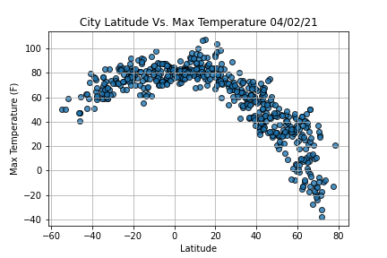
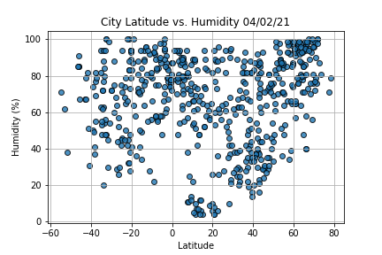
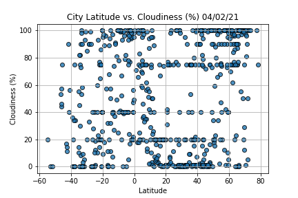
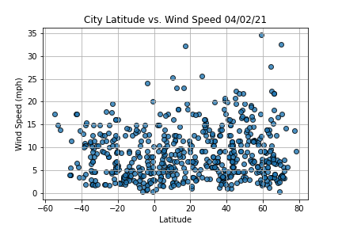
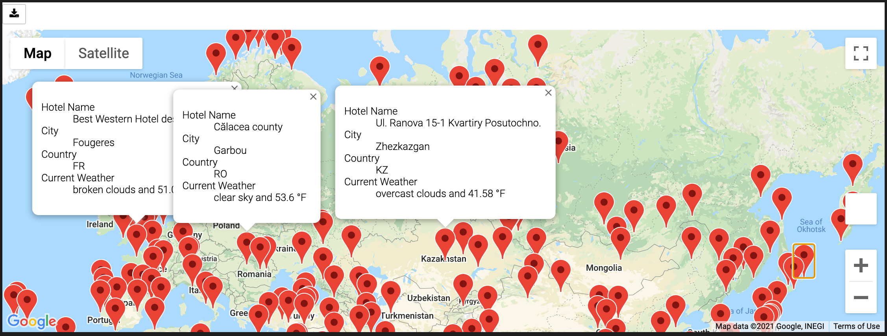
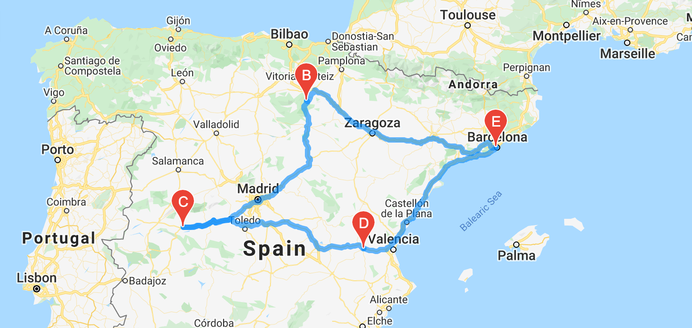
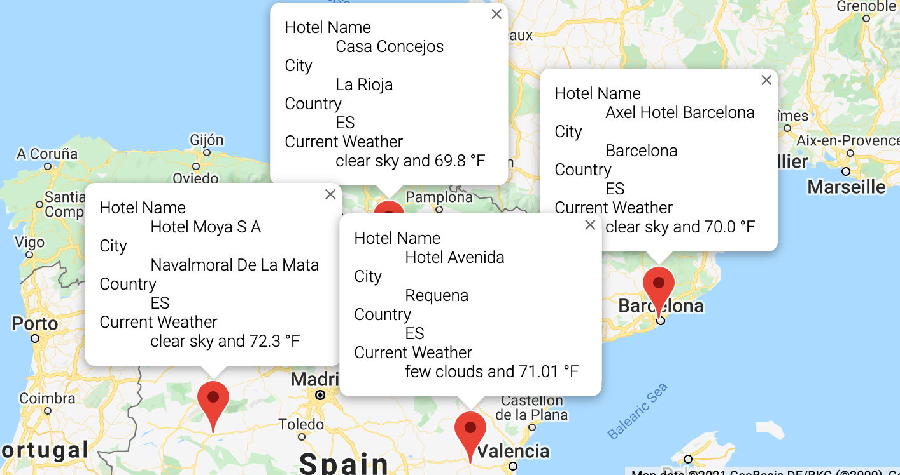

# World_Weather_Analysis

## Resources
* Python 3.9.0, 
* Anaconda Navigator 1.9.12,
* Jupyter notebook 6.0.3,
* Pandas, NumPy, citypy, requests, random ,GMaps, OpenWeather.

### Project Overview

 In the initial part of the project, we are asked to study if and how latitude impacts the weather in different cities around the world using Python, Pandas, and APIs. to do so we created the following figures.

### Travel planning

- On the following part of the analysis PlanMyTrip, a travel company, is asking us to help their customers find ideal hotel destinations based on their weather choice. to do so and using google Ipas we created a list of hotels in the cities that correspond to the user search criterias and we mapped them, the result is as follows:

- We were then asked to plan an itinerary for a trip that includes 3 stops given the city names, results is as follows:

- the details for each stop are .

